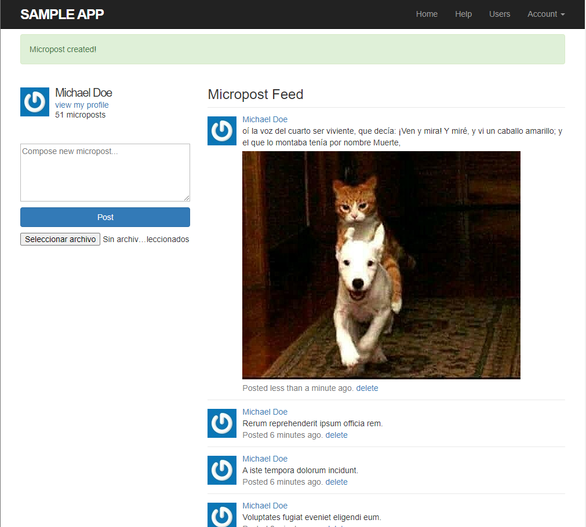

# Sample App

Professional-grade sample application. Although the sample app will eventually have users, microposts, and a full login and authentication framework


## Features

- Users: Signup, profile, edit profile, 
- Signup, Login
- Remember, forgot password, reset_password
- Micropost: Feed, post, delete

## Deployment

To deploy this project run

```bash
  npm run deploy
```


## Authors

- [@alejogtz](https://www.github.com/alejogtz)


## Demo

You can find the sample app on heroku https://railstuto-sample-app.herokuapp.com


## Usage/Examples

**Capture of feed**


