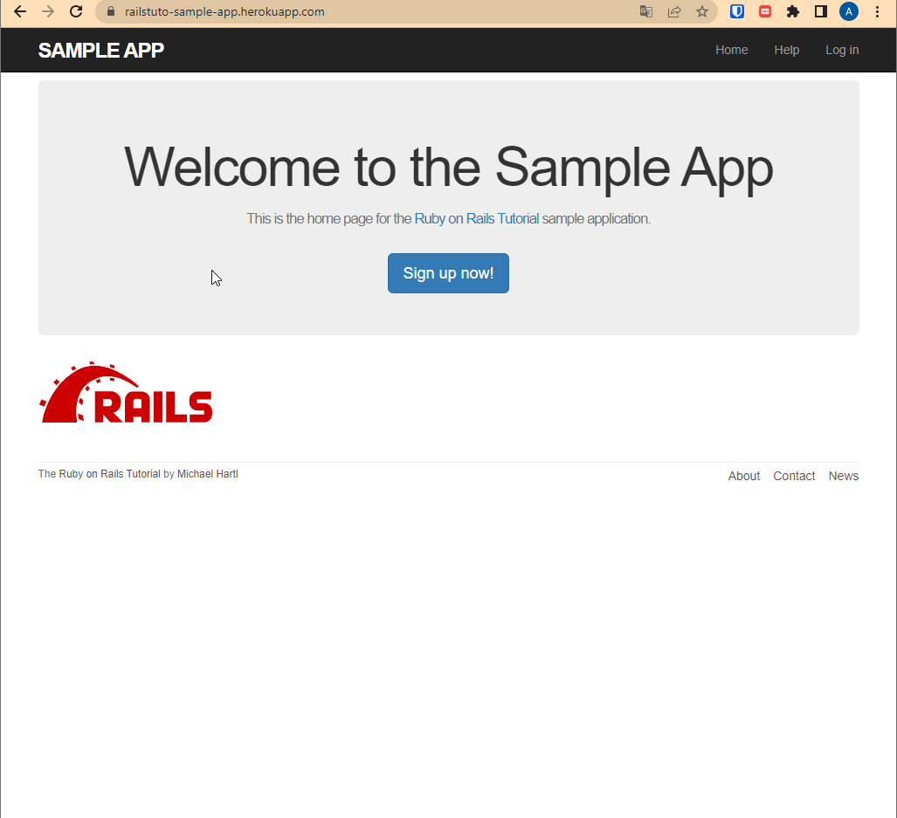
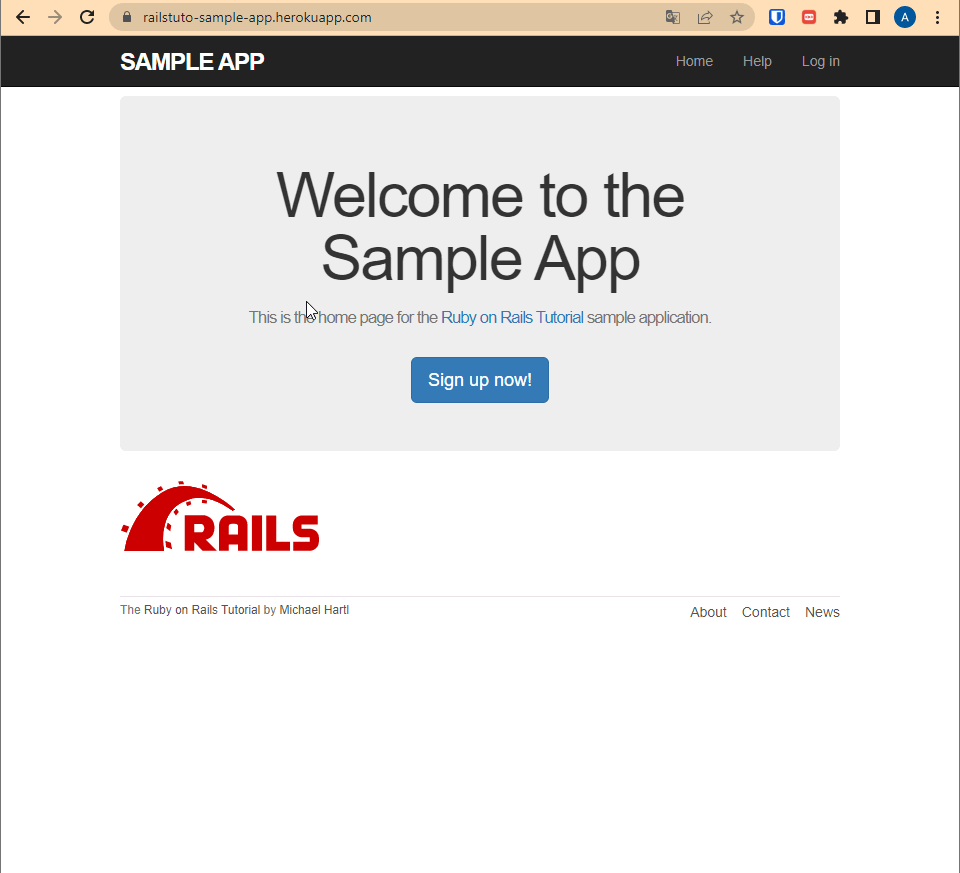
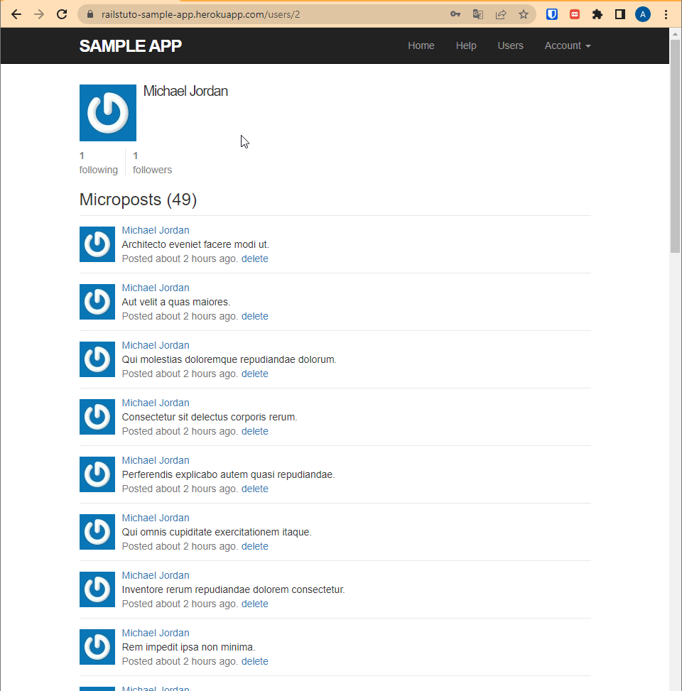
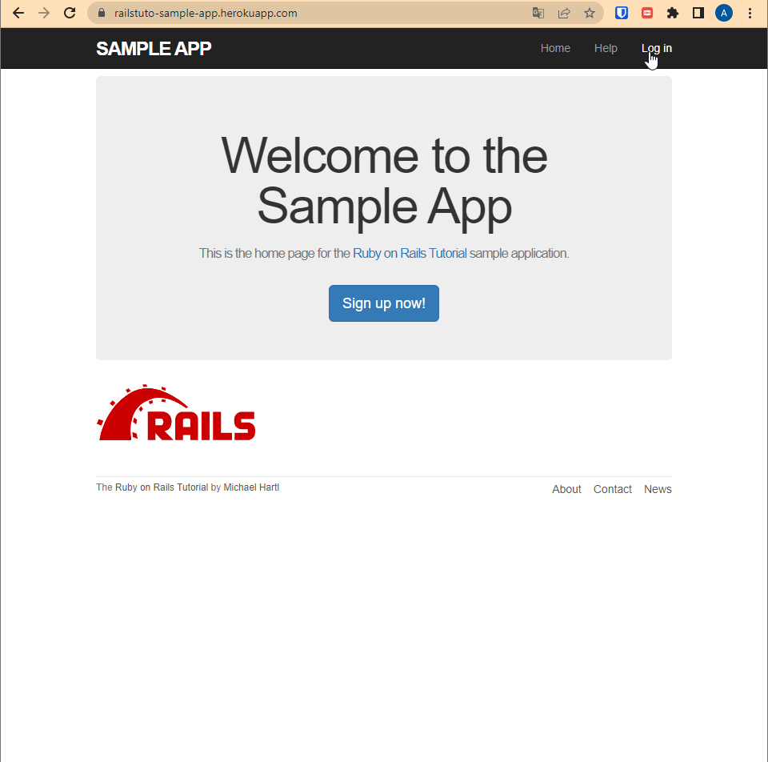
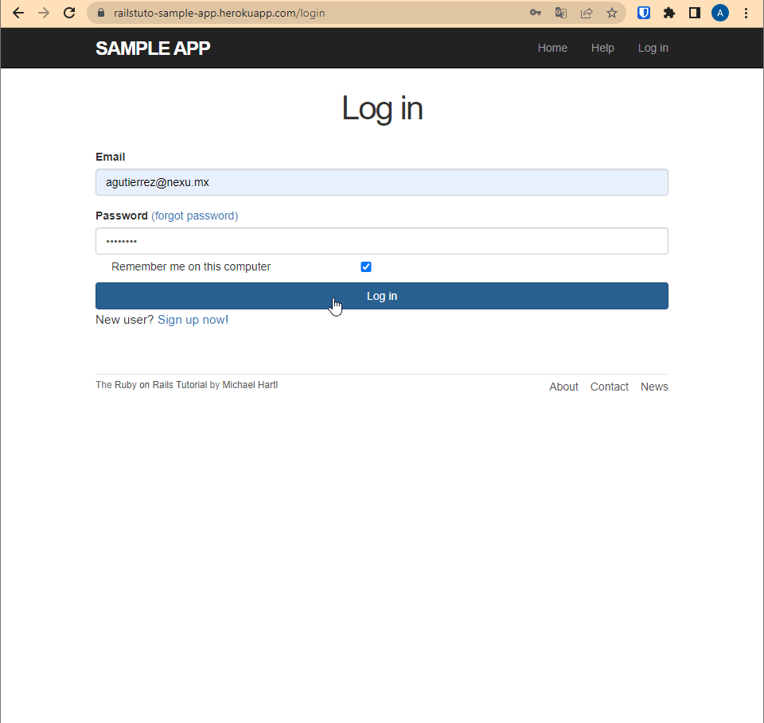

# Sample App

Professional-grade sample application. Although the sample app will eventually have users, microposts, and a full login and authentication framework

## Features

- Users: Signup, profile, edit profile, 
- Signup, Login, Restore password
- Microposts: Feed, new post, delete post
- Followers, Following
- Follow, Unfollow actions

## Authors

- [@alejogtz](https://www.github.com/alejogtz)

## Demo

You can find the sample app on heroku https://railstuto-sample-app.herokuapp.com

**New Account**

**Users List**

**Microposts**

**Edit profile**

**Forgot password**

**Followers, Following**

## Usage/Examples

**Capture of feed**

